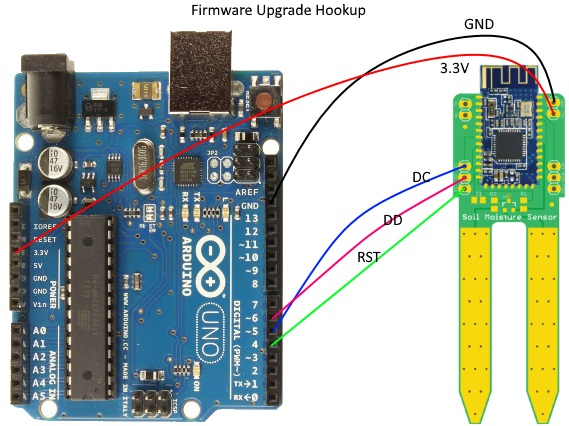
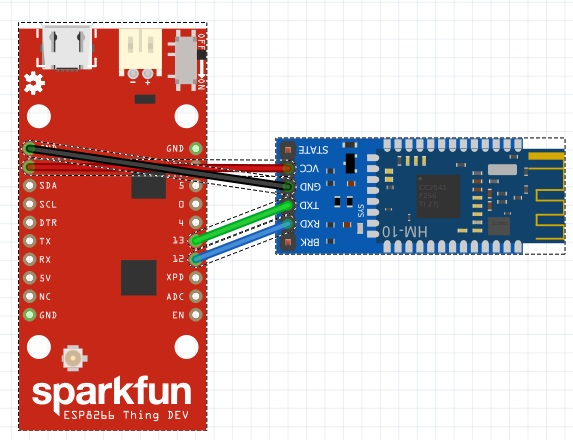

# AgroBlue
When BLE meets agronomy.

My idea is very simple yet ambitious. Imagine a fleet of BLE enabled soil probes working in harmony that can sense the environment and be able to communicate with a central unit. This central unit will be responsible for collecting data for analysis.

This proof of concept is the understanding of how the combination of all sensors reading correlate to each other, to maximize efficiency and increase crop yield in the open. Battery longevity and cost are my main goals, let's hope it will work out.

1st Step:(PCB)
---------
- Get your board fabricated! The Eagle files are provided as-is, without warranty of any kind so use it at your own risk!
I used https://oshpark.com/ for my fabrication shop because I heard so many positive reviews. I initially opted for the regular service which takes 3 weeks but they upgraded me for free because they had free room on one of our Super Swift Service panels, So thank you OSH Park.
 - Get the components, I've included the BOM but I will list them here for the sake of having everything in one page.

|Qty|Description|URL|Price|
|---|---|---|---|
|x 1|Coin Cell Battery Holders Linx CR2032 Battery Holder|http://www.mouser.com/search/ProductDetail.aspx?r=712-BAT-HLD-001|$0.25|
|x 1|Lithium Ion Polymer Battery 3.7V 350mAh|https://www.arrow.com/en/products/2750/adafruit-industries|$6.77|
|x 2|Res Thin Film 0805 100 Ohm 1% 0.25W (1/4W)|https://www.arrow.com/en/products/rncp0805ftd100r/stackpole-electronics|$0.0052|
|x 1|Cap Ceramic 0.1uF 16V X7R 10% Pad SMD 0805|https://www.arrow.com/en/products/cl21b104koannnd/samsung-electro-mechanics|$0.02|
|x 1|Trans GP BJT NPN 40V 0.6A 3-Pin SOT-23|https://www.arrow.com/en/products/mmbt2222alt3g/on-semiconductor|$0.02|
|x 1|Lithium Battery Coin 3V 225mAh|https://www.arrow.com/en/products/cr-2032lbn/panasonic|$0.18|
|x 1|SparkFun ESP8266 Thing - Dev Board|https://www.sparkfun.com/products/13711|$15.95|
|x 1|HM-10 BLE Module|https://www.aliexpress.com/item/HM-10-cc2541-4-0-BLE-bluetooth-to-uart-transceiver-Module-Central-Peripheral-switching-iBeacon-AirLocate/32460585727.html|$3.34|
|x 1|HM-10 BLE Module Breakout Board|https://www.aliexpress.com/item/Free-shipping-HM-10-Bluetooth-BLE-4-0-Module-transparent-serial-port-Bluetooth-4-0-module/1913999168.html|$4.75|

2nd Step:(Optional if you have BLE Module Clones)
-------------------------------------------------
If you've gotten yourself some HM-10 clones, fear not. The following is an effective way to upload the original firmware to the module. We are going to be using v540. the original files can be found here: https://github.com/RedBearLab/CCLoader.

1. Load the CCLoader Arduino sketch to the UNO board.
2. Wire the pins:
  
3. Use CCLoader.exe to load the CC2541hm10v540.bin to the UNO board and the board will burn the firmware to the BLE Mini.

3rd Step: (Configure BLE Modules Master/Slave)
----------------------------------------------

a) Slave:
Upload an empty sketch to Aruidno and hookup the sensor module with it like this:

HM-10||Arduino
|---|---|---|
TX|<---->|TX
RX|<---->|RX
GND|<---->|GND
VCC|<---->|3.3V

Open the serial and type the following command to switch the mode of transmission to remote:
AT+MODE2: Remote Control Mode
AT+ROLE0: Peripheral Mode (Default)
AT+PWRM0: Auto Sleep
AT+ADVIF: Set the advertising interval to 7s (MAX)
AT+NAMEXXX: Where XXX is your preferred name
AT+BAUD4: Set the baud rate to 115200
AT+RESET: Restart module

b) Master
Hook up the BLE Module Breakout board the same way as the Sensor per below and type the following commands:

On master side:
AT+RENEW: Restore all setup value to factory setup
AT+IMME1: Only respond the AT Commands
AT+ROLE1: Central/Master Mode
AT+NAMEXXX: Where XXX is your preferred name
AT+BAUD4: Set the baud rate to 115200
AT+RESET: Restart module

c) Upgrade firmware on genuine BLE module (Optional)
AT+VERR?: Will give you the version
For example, you need to be at least at V526 for analog support.

**HM-10** is designed and made by **JNHuaMao Technology Company**
More info on the upgrading process, visit http://www.jnhuamao.cn/

4th Step: (Getting the ESP8266 Dev Ready)
-----------------------------------------
	1- Make sure you hookup the BLE Central/Master with the ESP8266 per below because we will be using SoftSerial library.
	
	
	2- Use your Cayenne/Wifi credentials and upload main.ino located in Arduino/Code folder to the ESP8266. Open the serial and set it the baud rate to match your BLE Central.
	
	3- Alternatively, you can use CentalBLEConfig.ino for debuging purposes. The code echos the serial input to the BLE and vice versa.
	
	4- I found hooking up a lipo battery to the Slave BLE module works best because I found 3.3V is unusually lower for this kind of circuit. Make sure you don't hookup the cell and the lipo at the same time. There is no reverse current protection.
	
	5- Water your plan and you should see some reading coming through your cloud interface.